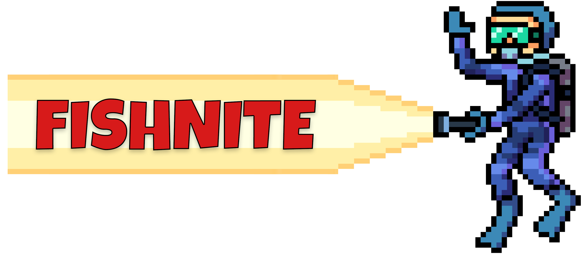

## Introduction

Fishnite is an educational videogame written entirely in Java with the purpose of educating elementary school children about the career options available at Delaware National Estuarine Research Reserve.
Fishnite takes the user on a short guide through the job of monitoring native populations, battling invasive species, and analyzing each species of fish.

## Gameplay

Fishnite is designed to run with only a keyboard; mouse or touchscreen are not required.

Use the WASD keys to move the player throughout the screen, positioning yourself over fish to catch them in your net. Head to the boat to deposit the fish and, if needed, analyse the catch.

As you become exposed to more species of fish, information will appear about that particular species; a correct analysis about that information will reward the player will power ups.

## Notable tech

Fishnite implements a simple fish AI to display basic fish behaviors, such as swimming in groups and threat detection and avoidance.

Fishnite also has variable difficulty scaling through the introduction of new species of fish, and an altering of the fish AI to ease or harden the difficulty curve.

## Authors

Nick Napior, Vincent Sargeni, Andrew Crossman, Kevin Faucher, & Marc Bolinas
